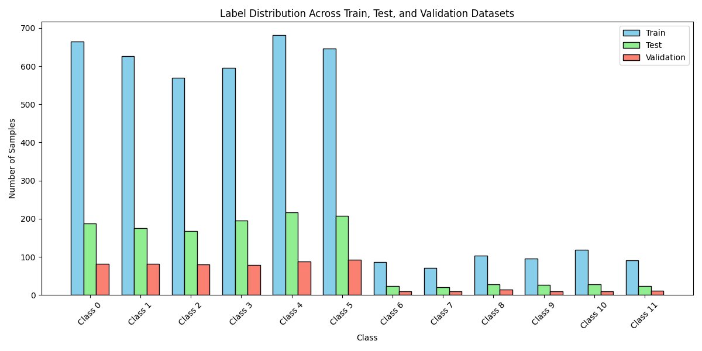
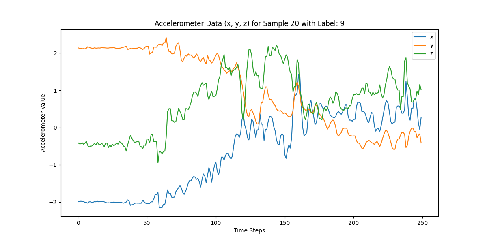
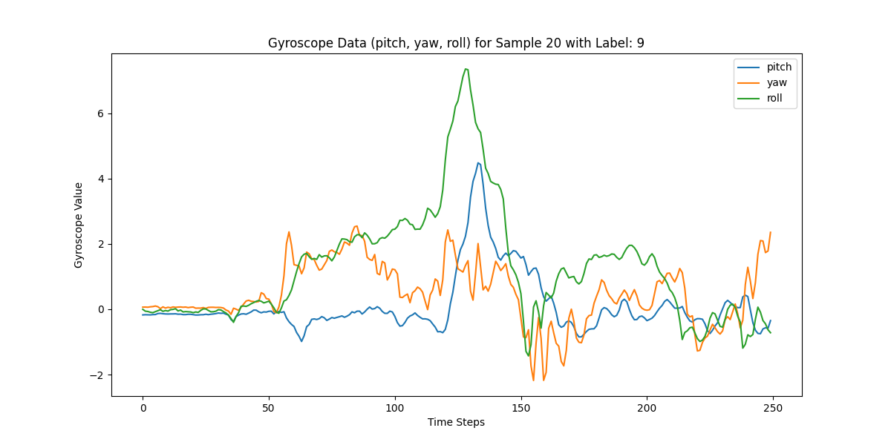
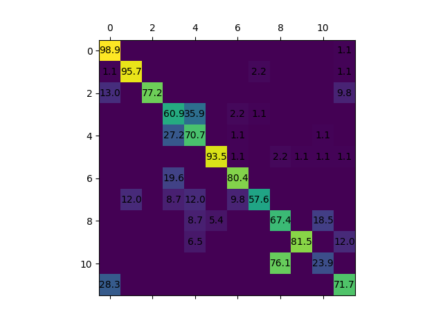

# Human Activity Recognition #

## Einleitung
- [Easy Run](#Easy Run (with default Setting))
- [Preparations](#Preparations)
- [How to run the code (Train)](#How to run the code(user define))
- [Data Handling](#Data Handling)
- [Evaluation](#Evaluation)


## Easy Run (with default Setting)
easy run Train
```
bash batch_train.sh
```
easy run Evaluation
```
bash batch_evaluation.sh
```
Default train: 3 layer LSTM with unit (128,64,32)

Default evaluation : 3 layer LSTM with unit (128,64,32) with label Threshold 0.6

## Preparations
Before beginning with the process, we choose the dataset, model and run mode.
```
flags.DEFINE_string('source_data', 'HAPT', 'Original Dataset-Source HAPT')
flags.DEFINE_string('model_index', '2', 'Choose your model from the Model index.')
flags.DEFINE_string('Mode', 'Train', 'Specify whether to Train or Evaluate a model.')
flags.DEFINE_string('weight_path', 'stacked_RNN_11.weights.h5', 'weight path to be evaluated')
```

## How to run the code(user define)
Basically the project provide three different Setting value to run the code:
```
--model_index=2
```
If the model_index is 1, then use the normal model
If the model_index is 2, then use the stacked model

```
--Mode=Train
```
If the Mode is Train, then train the RNN
If the Mode is Evaluation, then evaluate the RNN

```
--weight_path='stacked_RNN_11.weights.h5'
```
The weight_path is weight which be evaluated.


## Data Handling
Following steps are performed on the raw data
1) Z-Score Normalization 
2) Sliding Window Technique to gain fixed-length input sequences
	 - HAPT: predominant lable will be assigned to window (see LABELING_THRESHOLD)
3) Split into Train, Validation, Test dataset (roughly 70, 10, 20%)
4) Oversampling
5) Saved the dataset as TF Record File to be ready for the next loaded

## Train
Following are the important configurations for training in ```config_HAPT.gin```:
<pre>
N_EPOCHS = 1000
BUFFER_SIZE = 200
BATCH_SIZE = 20
input_shape = (%WINDOW_SIZE, %SENSOR_CHANNELS)
LSTM_UNITS = (11,11)
</pre>

## Statistics
#### Statistics of dataset:
The Dataset HAPT is imbalanced dataset. The following image is the dataset distribution.


###
#### Random samples of each class from the HAPT dataset:




## Evaluation

easy run Evaluation
```
bash batch_evaluation.sh
```

If you want to evaluate different model, you need to train first or change the evaluate path for weight file and evaluate model.
For example you need to change the --weight_path= path to weight file.
Then you need to change the model (for example 3 layer LSTM with unit 11 then change it in config_HAPT.gin)
LSTM_UNITS = (11,11,11)

## Results
The results will be presented the confusion matrix and tabel of the result.


#### Results of different models for HAPT-Dataset 12 activities-classification:
| Type of Layers | Number of Units | Dropout Layers | Dropout rate | Window size | Window shift | Balanced Accuracy |
|---------------|---------------|---------------|---------------|------------|-------------|------------------|
| 1 LSTM       | 256           | 1             | 0.40          | 250        | 0.3         | 80.70%           |
| 2 LSTM       | (11,11)       | 1             | 0.1           | 250        | 0.3         | 83.72%           |
| 2 LSTM       | (128,128)     | 1             | 0.55          | 250        | 0.3         | 85.99%           |
| 2 LSTM       | (256,256)     | 1             | 0.55          | 250        | 0.3         | 87.63%           |
| 2 GRU        | (256,256)     | 1             | 0.55          | 250        | 0.3         | 85.26%           |
| 3 LSTM       | (256,256,256) | 2             | 0.55          | 250        | 0.3         | **89.98%**       |
| 3 LSTM       | (256,256,256) | 2             | 0.55          | 250        | 0.5         | 86.97%           |
| 3 GRU        | (256,256,256) | 2             | 0.55          | 250        | 0.3         | 85.62%           |
| 3 LSTM       | (512,512,512) | 2             | 0.59          | 250        | 0.3         | 89.61%           |
