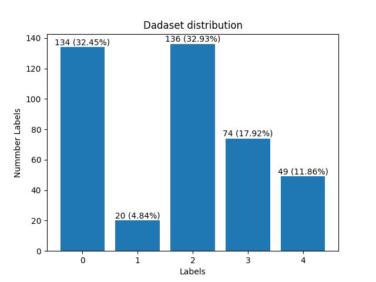
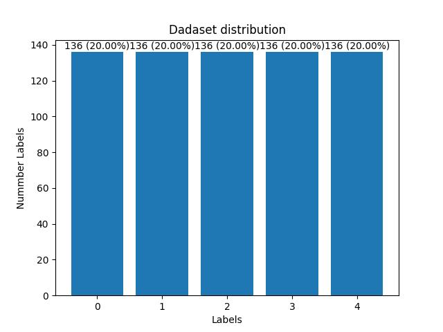

# Diabetic retinopathy recognition #

## Einleitung
- [Easy Run](#Easy Run (with default Setting))
- [Preparations](#Preparations)
- [How to run the code (Train)](#How to run the code(user define))
- [Evaluation](#Evaluation)
- [Visualization](#Visualization)
- [Important Information](#Important Information)

## Easy Run (with default Setting)
easy run Train
```
bash batch_train_vgg.sh
```
```
bash batch_train_transferlearning.sh
```
easy run Evaluation
```
bash batch_evaluation.sh
```

## Preparations

The preprocessed images are already generated, processed, and stored on the GPU server.

Detailed Information:
Before feeding data into the input pipeline, all data must be preprocessed. The preprocessing code operates independently of the training and input pipeline. This code should be executed locally.

If you need to preprocess the images again, run the bash script named preprocess.sh.


## How to run the code(user define)
Basically the project provide three different Setting value to run the code:
```
--train=True
```
If the train is True, then train the model
If the train is False, then evaluate the model

```
--visu=False
```
If the visu is True, then use the GRAD-CAM to visualise the model and store the results
If the visu is False, then close the deep visualization

```
--model=vgg2
```
With this Variable, you can chosse which model that u want to train. Default train model: vgg2. 
Those model is supported to trained model. The number in the model means 5 classes classification or binary classification.

# Model should be choose from the folgende !:
- vgg2    # vgg like structrue with res block binary classification
- vgg5    # vgg like structrue with res block 5 class
- dense2  # cnn with dense block binary classification
- dense5  # cnn with dense block 5 classfication
- mobilenetv3large2 # transfer_learning with model v3large 2 classification
- mobilenetv3large5 # transferlearning with moden mobilenetv3large 5 classification
- mobilenetv3small2 #transfer_learning with model v3small 2 classification
- transformer # vision transformer


#### Statistics of raw data:



# Visualization

We provide the deep visualization (GRAD-CAM) during the training progress. Then we can observe the change of the attention of the model through the training process.

IMPORTANT INFOMATION
The visualization will store the image on GPU Server. It will take a lot of store place on the disk.
With this reason is the default of visualization setting closed.

If you want to open the visualization then change the command in the bash file
```
flags.DEFINE_boolean('visu',False,'check if we need to save the deep visualisation results')
```

# Evaluation
We offer several weights to evaluation our trained model. You can also use the bash File that we provide to. Of course you can change the evaluation with the weights that you trained. But take care of the weights we will store the weights during the training, so run the bash file XX to clean the weights store place.

Run the bash File:
```
bash batch_evaluation.sh
```
If you want to change the evaluation model, please change to model in the evaluation file.

There are serveral models already be trained that supports to evaluate

# Model should be choose from the folgende !:
- vgg2    # vgg like structrue with res block binary classification
- vgg5    # vgg like structrue with res block 5 class
- dense2  # cnn with dense block binary classification
- dense5  # cnn with dense block 5 classfication
- mobilenetv3small2 #transfer_learning with model v3small 2 classification

If you want to validate models other than this one, you may need to first train the files and then modify the weights file name and the loaded model for validation.


## Important Information 
"""If you want to validate models other than this one, you may need to first train the files and then modify the weights file name and the loaded model for validation.
File
"/home/kusabi/DLLAB/dl-lab-24w-team06/.venv/lib/python3.12/site-packages/gin/config.py", line
1859, in _iterate_flattened_values
  if isinstance(value, collections.abc.Mapping):
    value = collections.abc.ValuesView(value)

  if isinstance(value, collections.abc.Iterable):
    for nested_value in value:
      for nested_nested_value in _iterate_flattened_values(nested_value):
        yield nested_nested_value
here should be the module collection.abc.
"""
